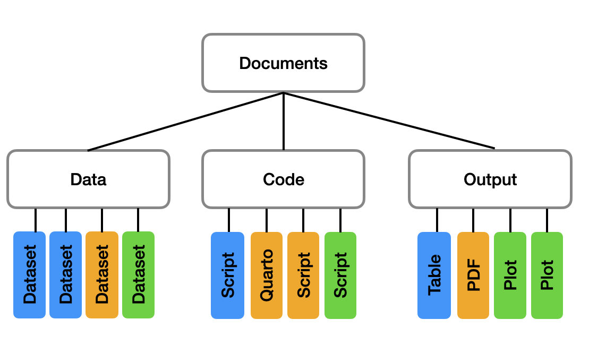
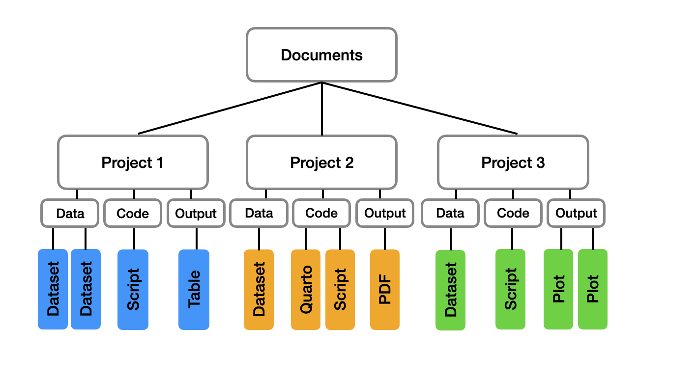
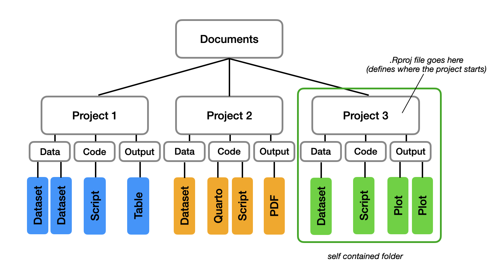
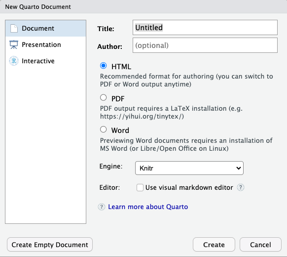
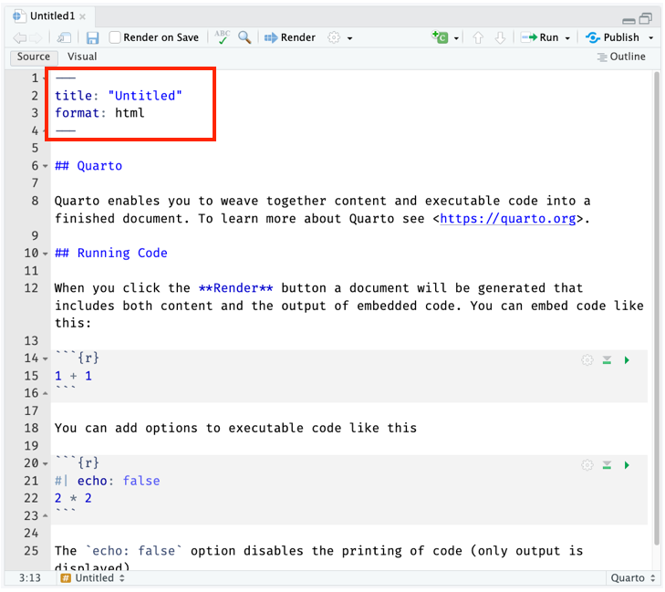
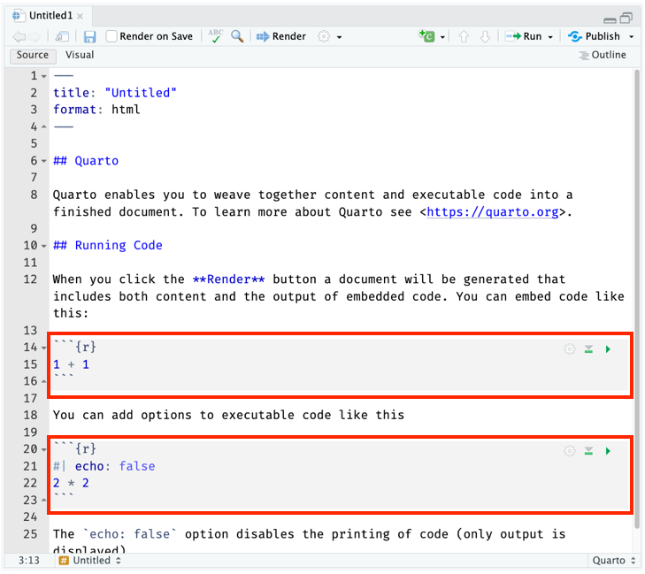
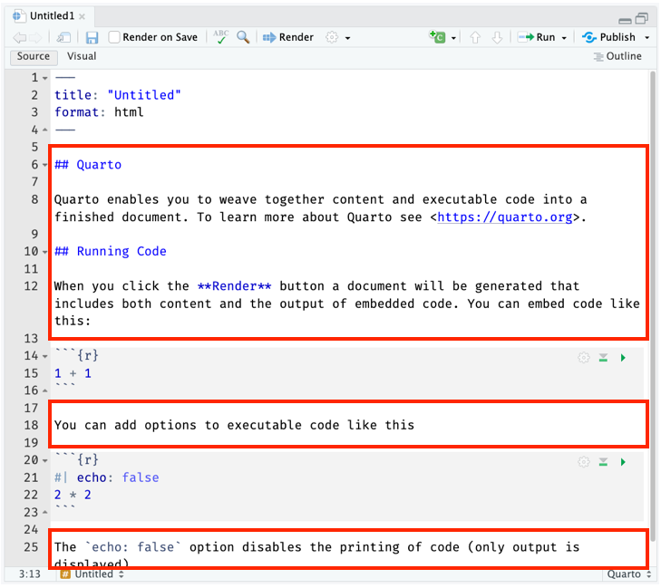

# Introduction to R 

```
$ echo "Data Sciences Institute"
```

---

### Resources for this lesson

R basics

* [Chapter 2 of Hands-On Programming with R](https://rstudio-education.github.io/hopr/basics.html)
* [Blog post on Project-oriented workflow by Jenny Bryan](https://www.tidyverse.org/blog/2017/12/workflow-vs-script/)

Quarto

* [Using R, quarto.org](https://quarto.org/docs/computations/r.html)

R packages and help pages

* [Chapter 3 of Hands-On Programming with R](https://rstudio-education.github.io/hopr/packages.html)

---

## Getting set up

---
### R

What is R?

- A programming language focused on statistics
- Open source and free

### Getting R

1. Go to https://cloud.r-project.org/ 
2. Click *Download R for (your operating system)*.
3. For Windows, select *install R for the first time*. For Mac and Linux, select the download that is appropriate for your OS.
4. Download and install.

---

### RStudio

What is RStudio?

- The integrated development environment (IDE) that lets us run R code
- Desktop and cloud versions available

### Getting RStudio

1. Go to rstudio.com
2. Under *Products*, look under *Open Source* and select *RStudio.
3. Scroll down and select *RStudio Desktop* and *DOWNLOAD RSTUDIO DESKTOP*.
4. Select the *DOWNLOAD* button under the *Free* version of RStudio Desktop.
5. If the download that is "Recommended for your system" is correct, click the download button. If not, scroll down and find the version that is correct for your OS.
6. Download and install.
7. Open and test to ensure RStudio is working.

---

## Any questions with R or RStudio setup?

---

### If you have downloaded R and RStudio:
* Read about RStudio: http://swcarpentry.github.io/r-novice-inflammation/09-supp-intro-rstudio/index.html

* Watch the video about data science tools. Pay attention to R: https://www.youtube.com/watch?v=pKPaHH7hnv8&t=99s

---

## RStudio

---

### Welcome to RStudio


---

The editor, where you can write and edit files, are in the upper left. If you do not have a file open, this section will be collapsed.


---

The console, where you test code and view output, is on the lower left.


---

The environment, where you can see variables that you have saved, is on the upper right.


---

The lower right section contains:

- *Files*, where you see the folder structure of your working directory
- *Plots*, where plots you create are displayed
- *Packages*, an inventory of all R packages that are installed
- *Help*, where you can search information about R functions and packages


---

### Interacting with R in the console

The console is used to run and test code -- use this for code that you don't need to save.

* Type commands directly into the console and press ‘Enter’ to execute.
* Clear console with ‘Ctrl’ + ‘L’
* If R is still waiting for you to enter more text (e.g. because of an accidental open parenthesis or quote), the console will show a `+` prompt instead of `>`.
    * If stuck, use 'ESC' to quit the current input

---

### Demo: Console

1. Try adding two numbers together
2. Try assigning a variable by typing:

`x <- 123`

---

### Directories and R Projects

* Good to keep data, analyses, and text in a single folder. 
* "R Projects" make some aspects of organizing a project more convenient
  * 'File' → 'New project' → 'New directory' -> 'New project' -> name directory (e.g. "DSI_R") -> 'Create'

What this does:

1. Creates a new directory
2. Creates a '.RProj' file (defines the top-level directory of the project)
3. Starts a new session and sets the "working directory"

---

### Not ideal file structure



---

### Desired file structure



---

### Desired file structure



---

### Using the editor

* The most basic R file is a script, which contains code to be executed in sequence
* Create a new script with 'File' -> 'New File' -> 'R Script', or Ctrl/Cmd + Shift + N
* Run current line with Cmd/Ctrl + Enter
* Run entire script with Cmd/Ctrl + Shift + Enter
* Save with 'File' -> 'Save' or Ctrl + S

---

### Diagnostics

When working in a script, RStudio will mark syntax errors. If you hover over the red x, you can see what the problem is.


----

### Demo: Projects and Editor

1. Create a new R Project
2. Create a new R script within the R Project
3. Assign some number to the variable `x` (again with `x <- ` syntax)
4. Multiply the number by itself using `*`

---

## R basics

---

### Creating objects

`<-` is the assignment operator.

To assign the value 27 to the object named `num_participants`, you type:

```r
num_participants <- 27
```

Remember that names:

- must start with a letter
- can only contain letters, numbers, underscores, and periods

Running the name of the object will display the object.

```r
num_participants
```
---

### Functions

Functions perform tasks that are too complicated or repetitive to write out repeatedly. They take the form:
`function_name(argument1 = value1, argument2 = value2, ...)`

R comes with some built-in functions. For example:

```r
paste("abc", "def")
sqrt(16)
seq(1, 14)
```
---

### Custom functions

You can define your own functions with the following syntax:

```r
my_function <- function(argument1, argument2, ...) {
  # <code to execute the function>
  return(output)
}
```
* not all functions have inputs or "arguments"
* the `return()` line defines what the final result of the function should be

---

### Comments in code

Use `#` to explain your code where you think it might be useful. For example:

```r
x <- 9 # I chose 9 because it's my favourite number

# This function below divides a number by 10
divide_by_9 <- function(some_number) {
  some_number_divided <- some_number / 9
  return(some_number_divided)
}

# Test my function:
divide_by_9(72)
```

---

### Demo: Functions

1. Write a function `add_10` that takes a number and adds 10 to it. 
2. Write a function that takes two words and uses `paste` to form the sentence "I like ___ and ___."

---

### Summary so far

At this point, we've learned:

* how to navigate the RStudio interface
* when to use console and editor
* how to create objects and functions
* how to write comments in code

**Questions?**

---

## Quarto and coding style

---

### Quarto

Quarto files are a way to work with code and text in the same document. 

* Create a new Quarto file by going to 'File' -> 'New file' -> 'Quarto document'

For now, create using the defaults -- this can all be changed later.


---

### Parts of a Quarto document

The header ("YAML header") contains metadata -- information about the document itself, like its `title`. You can have other options, like the `author` or `date`. 



^[More on this later, or here: [\[about YAML\]](https://rpubs.com/drgregmartin/1266674) [PDF YAML options](https://quarto.org/docs/reference/formats/pdf.html)]

---

### Parts of a Quarto document

Code chunks are denoted with three ticks (```) at the beginning and the end of the code. 

Like with a script, you can use the Run button or Cmd/Ctrl + Enter or the little green arrow. Output will show in-line.



---

### Parts of a Quarto document

You can write (human) text anywhere below the header and outside the code chunks.



---

### Why use Quarto?

* Useful like a notebook (like we will do in this module) 
* Easily embed output and convert to other formats (e.g. pdf) for sharing
  
---

### Demo: Quarto

1. Create a new Quarto document
2. In a new code chunk, define a function that takes a number and raises it to the power of itself, and test that it works
3. Make sure the `format` in the header is `html`
4. In RStudio, 'Render' the document
5. Open a browser to see the finished product


---

## Packages and Help

---

### R Packages

* We've seen that R comes with some built-in functions (like `sqrt()`)
* R *packages* are collections of functions, data, and compiled code that extend R's functionality
* *Libraries* refer to where the packages are stored.

Many useful packages need to be downloaded and installed with `install.packages()`. We then need to load the package with `library()`. 

---

### R Packages

For example, the `palmerpenguins` package contains a dataset that we will be using in this module:

```r
# Install package (only need to do this once on your computer)
install.packages("palmerpenguins")

# Load package (do this every time you restart R)
library(palmerpenguins)

# Now we're able to access a dataset from this package
data(penguins)
penguins
```
---

### R packages

Where do packages come from?

* [CRAN](https://cran.r-project.org/web/packages/) is the most popular and default place for developers to publish their packages
* when using `install.packages()`, the default is to look for the package in CRAN

Packages can also be installed from other sources, but instructions will vary

* [Bioconductor](https://www.bioconductor.org/packages/release/bioc/)
* GitHub repositories 

---

### `tidyverse`

The [tidyverse](https://www.tidyverse.org/) is a collection of related R packages that provide data science tools.

We will be using tools from the tidyverse throughout this module. Install the entire collection with:

```r
install.packages("tidyverse")
```


---

### `tidyverse`

Why is the tidyverse worth mentioning in particular?

* entire ecosystem of powerful packages
* very popular
* **different syntax from "base" R**

---

### Looking up help

If a function or dataset is built-in or comes from a package, there is usually a help page that describes it, which you can access with `?` or `help()`

```
?round 
help("paste")
?palmerpenguins
help(package = "tidyverse")
```

Many popular packages also come with online help pages or manuals. 

---
### Demo: installing and using an unfamiliar package

1. Install the [`climate` package](https://cran.r-project.org/package=climate).
2. Find the closest weather station to Toronto Pearson airport (lat: `43.67`, lon: `-79.63`).
3. Find the weather information from yesterday from that station.

---

### Summary

Since the last check-in, we've learned:

* what components make up a Quarto document
* why Quarto documents are useful
* how to install and load packages
* what the tidyverse is
* how to look for documentation on packages and functions

**Questions?**

---

### Exercises

1. Using the built-in functions `seq()` and `median()`, write a function called `find_middle()` that:

* takes two numbers as inputs, then
* produces a sequence that counts between them in increments of 1, then
* finds the middle of the sequence

2. Install the `faraway` package from CRAN. Then, in a new Quarto document, 

* load this package and load the `broccoli` dataset from this package. 
* Use the `head()` function to print the first 6 rows of the data
* Change the `format` to `pdf` and render the document

---

### Exercise 1 Hint

Fill in the blanks:

```r
find_middle <- function(number1, number2) {

  sequence <- seq(____, ____)
  middle <- median(____)
  
  ____(middle)
  
}
```


